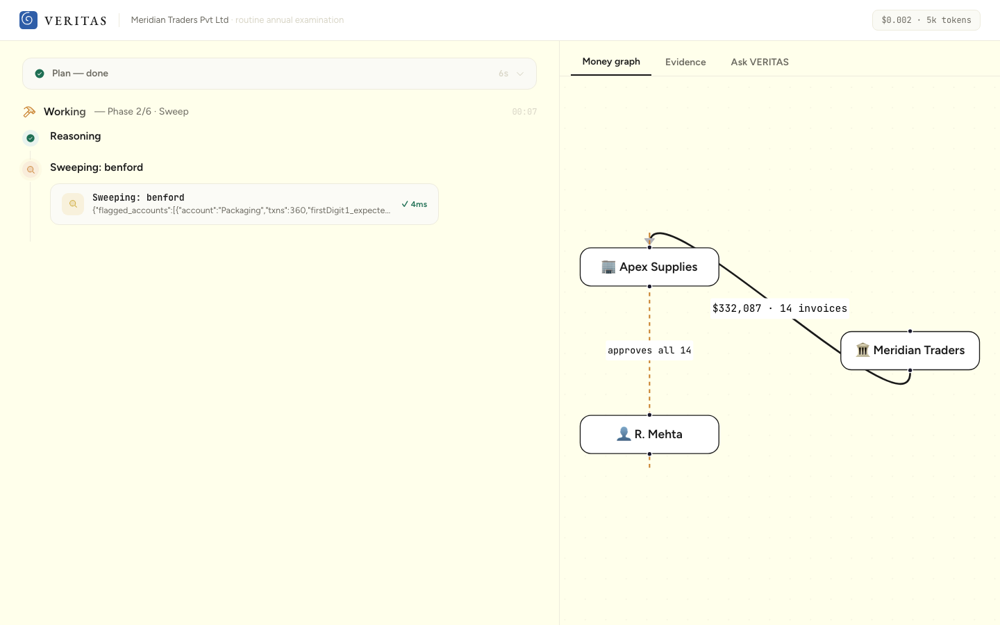

<div align="center">


# VERITAS

### The AI Forensic Auditor

**Companies lose 5% of revenue to fraud. Audits catch 3% of it.**
**VERITAS reads 100% of the books — and finds the fraud in minutes.**

[How it works](#how-it-works) · [Why it can't hallucinate](#why-it-cant-hallucinate) · [The independent verifier](#the-independent-verifier) · [Run it](#run-it-locally)

<br/>


<sub>VERITAS confirms a shell-company scheme: the money graph turns crimson the moment it proves the vendor and the approving employee share an address.</sub>

</div>

---

## The problem

```
5%       of revenue lost to fraud, every year        ($5 trillion globally · ACFE 2024)
3%       of frauds caught by external audit          (a tip catches 43% — 14x more)
12 mo    median time a fraud runs before detection
```

Audits catch so little because humans **sample** — they read 1% of the books and hope.
The most common fraud on earth (ACFE) is the **billing scheme**: an employee creates a
shell vendor, approves its fake invoices, and drains the company. It hides in plain sight
across thousands of documents no one re-reads.

## What VERITAS does

VERITAS is an autonomous agent that runs a full **forensic examination** of a company's
books — general ledger, every invoice, bank statements, vendor master, employee records —
and works each anomaly to a verdict. It doesn't summarize documents; it **investigates**
them and produces a court-ready report where every claim cites its source.

```
PLAN ─▶ SWEEP ─▶ INVESTIGATE ⟳ ─▶ VERIFY ─▶ DECIDE ─▶ REPORT
 │        │           │              │          │         │
 risk-    Benford,    chase each    recompute  file      cited fraud
 ranked   duplicates, anomaly to    every $    findings, examination
 plan     conflict-   a verdict;    figure     freeze    report +
          of-interest clear the                vendor    evidence
          scan        innocent                 (human    exhibits
                                               approves)
```

<div align="center">

<br/>
<sub>The live console: every plan step, tool call, and citation streams in as the examination runs.</sub>
</div>

On the demo books (2,263 transactions, 2,304 documents), VERITAS catches a shell-company
scheme — vendor **Apex Supplies**, whose registered address is identical to the procurement
manager's home address, 14 sequential invoices, zero purchase orders, **$332,087** — in
**under 3 minutes**. It clears two innocent red herrings along the way, and files a cited
report. The average fraud runs 12 months undetected.

## Why it can't hallucinate

This is the core engineering claim, and it's structural, not aspirational:

- **`file_finding` rejects any uncited claim.** Every evidence item must carry `doc_ids`
  or a `recompute` reference, or the finding never enters the report.
- **Every dollar figure is recomputed** from the ledger before it can be filed.
- **A shell-company finding is rejected unless a real `cross_reference` address/bank match
  exists** — so false accusations are structurally impossible.
- **Verified on clean books:** on companies with no fraud, VERITAS files nothing and reports
  "no material findings." It does not cry wolf.

Result on a 10-company evaluation fleet (8 with planted schemes, 2 clean):
**10/10 correct verdicts, 0 false accusations.**

## The independent verifier

Before any finding is filed, a **second examiner from a different model family** — NVIDIA's
**Nemotron-Cascade-2** — independently reviews it and tries to **refute** it. It is handed
the finding *and* the disconfirming evidence, and told to uphold only if the fraud theory
survives every innocent explanation.

- **Upheld** → the finding stands, now with a cross-model second opinion on the record.
- **Refuted** → the finding is downgraded to *unproven* — a caught false accusation.

<div align="center">

<br/>
<sub>NVIDIA Nemotron independently reviews the finding and upholds it before it enters the report.</sub>
</div>

Two examiners from different families rarely share the same blind spot, so a claim that
survives both is far stronger than one model's confidence. This is the same principle as a
second doctor's opinion, applied to fraud. Nemotron also runs the fast statistical sweep as
the *junior examiner* — cheap triage, expensive reasoning only where it's needed.

## Interrogate the case

The examination isn't a dead report. Every finding, figure, and cleared item is queryable in
natural language — and every answer is drawn from the same cited evidence, never invented.

<div align="center">

</div>

## How it works

- **Two-tier examiner (Vultr Serverless Inference).** A **junior examiner (NVIDIA
  Nemotron-Cascade-2)** runs the fast statistical sweep and independent verification; a
  **senior examiner (Kimi K2.6)** runs the deep investigation, verification, and reporting.
  The split mirrors how real audit teams staff juniors and seniors. Both models were chosen
  by an empirical bake-off ([`scripts/bakeoff-results.md`](scripts/bakeoff-results.md)), not
  by guess.
- **Genuine reasoning, not a script.** The agent hypothesizes, tries to *exonerate* each
  suspect first, rules out five classes of innocent explanation, and confirms only what
  survives. On clean books it clears; on a real shell it confirms — same method, different
  evidence.
- **Three retrieval modes.** SQL over the ledger (exact math, never hallucinated), full-text
  search over documents (cited), and entity cross-referencing (the tool that cracks the case
  — employee addresses are deliberately *not* in the SQL surface, so the reveal can't be
  shortcut).
- **Streaming console.** Every plan step, tool call, hypothesis, and citation streams live
  over SSE into a forensic-console UI: an investigation timeline, a money-flow graph that
  turns crimson on the reveal, an evidence drawer, and a one-tap human-approved vendor freeze.

## Architecture

```
┌───────────────── CONSOLE (Next.js) ─ streams from SSE ──────────────────┐
│  investigation timeline │ money graph (react-flow) │ evidence · verdict  │
│                          │                          │ · ask VERITAS       │
└─────────────────────────────────▲───────────────────────────────────────┘
                                   │ Server-Sent Events (typed vocabulary)
┌─────────────────────────────────┴───────────────────────────────────────┐
│  ORCHESTRATOR (Hono) — async-generator loop, per-turn spend guard        │
│  LLM layer: Vultr Serverless Inference · junior/senior routing · failover│
│  15 tools (Zod-validated, every failure → error result, self-repair)     │
│  independent verifier: Nemotron refutes each finding before it is filed  │
│  data: SQLite ledger + views · FTS5 document index · entity cross-ref     │
└───────────────────────────────────────────────────────────────────────────┘
```

## Run it locally

```bash
pnpm install
pnpm --filter @veritas/datagen generate            # build the demo company
cp .env.example .env                               # add your Vultr inference key
pnpm --filter @veritas/server start &              # forensic engine on :8787
pnpm --filter @veritas/web dev                     # console on :3000
# open http://localhost:3000
```

Everything runs on **Vultr Serverless Inference** — reasoning (Kimi K2.6 + NVIDIA Nemotron)
and retrieval. No other LLM provider is used.

## Stack

`Vultr Serverless Inference` (Kimi K2.6 · NVIDIA Nemotron-Cascade-2) · `Hono` · `Next.js` ·
`react-flow` · `node:sqlite` + FTS5 · `Zod` · TypeScript.

## License

MIT — see [LICENSE](LICENSE).

<div align="center"><sub>Built at the RAISE Summit 2026.</sub></div>
