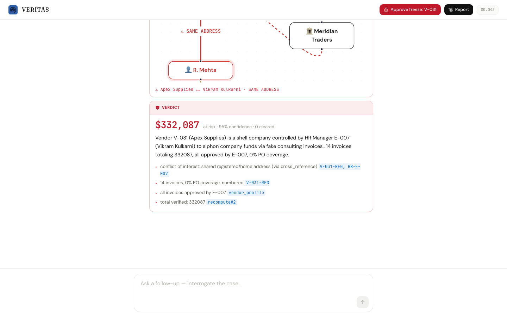
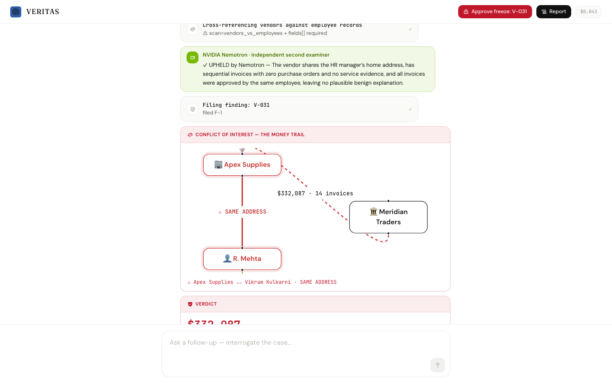
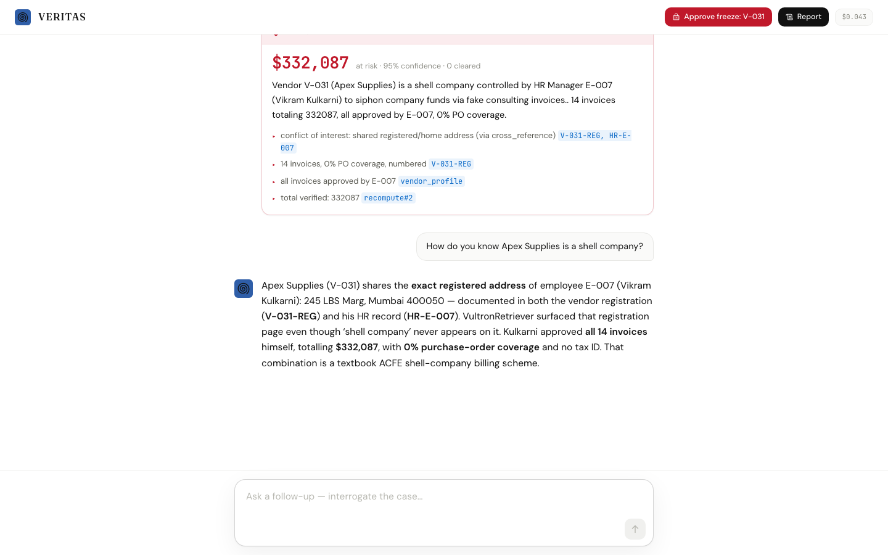

<div align="center">


# VERITAS

### The AI Forensic Auditor

**Companies lose 5% of revenue to fraud. Audits catch 3% of it.**
**VERITAS reads 100% of the books — and finds the fraud in minutes.**

A chat-native enterprise agent that runs a full forensic examination of a company's books,
grounded in the documents by **VultronRetriever** and reasoned by **Vultr Serverless Inference**.

[How it works](#how-it-works) · [Built on Vultr](#built-entirely-on-vultr) · [Why it can't hallucinate](#why-it-cant-hallucinate) · [The independent verifier](#the-independent-verifier) · [Run it](#run-it-locally)

<br/>



<sub>You talk to it. It investigates in the thread — retrieving documents, chasing anomalies, and turning the money graph crimson the moment it proves a vendor and the approving employee share an address.</sub>

</div>

---

## The problem

```
5%       of revenue lost to fraud, every year        ($5 trillion globally · ACFE 2024)
3%       of frauds caught by external audit          (a tip catches 43% — 14x more)
12 mo    median time a fraud runs before detection
```

Audits catch so little because humans **sample** — they read 1% of the books and hope.
The most common fraud on earth (ACFE) is the **billing scheme**: an employee creates a
shell vendor, approves its fake invoices, and drains the company. It hides in plain sight
across thousands of documents no one re-reads.

## What VERITAS does

VERITAS is not a chatbot and not a dashboard — it's an **agent you talk to** that runs a full
**forensic examination**. You ask it to audit a company's books; it plans, **retrieves the
documents that matter (more than once, as the investigation demands)**, calls tools, clears the
innocent explanations, confirms the fraud, and produces a court-ready verdict where every claim
cites its source — all streaming into one chat conversation you can interrogate.

```
you ─▶ PLAN ─▶ SWEEP ─▶ INVESTIGATE ⟳ ─▶ VERIFY ─▶ DECIDE ─▶ REPORT ─▶ interrogate
        │        │           │              │          │         │          │
        risk-    Benford,    retrieve docs  recompute  file      cited      ask it
        ranked   duplicates, (VultronRe-    every $    findings, fraud      anything;
        plan     conflict-   triever) +     figure     freeze    exam +     it answers
                 of-interest chase each                vendor    evidence   from the
                 scan        anomaly to a   (human               exhibits   cited
                             verdict        approves)                        evidence
```

On the demo books (2,263 transactions, 2,304 documents), VERITAS catches a shell-company
scheme — vendor **Apex Supplies**, whose registered address is identical to the procurement
manager's home address, 14 sequential invoices, zero purchase orders, **$332,087** — in
**minutes**. It clears two innocent red herrings along the way, and files a cited report.

## Built entirely on Vultr

Every model call runs on Vultr Serverless Inference — there is no other provider.

```
DOCUMENT RETRIEVAL   →  VultronRetriever   Prime-8B · Core-4.5B · Flash-0.8B   (/v1/rerank)
   reads the whole page — layout, tables, addresses, tax IDs — and surfaces the document
   that matters even when your query words never appear on it. Catches what keyword search
   misses: it pulls the vendor registration whose address exposes the shell.
CORE REASONING       →  Qwen3.6-27B  (senior + junior; Qwen3.5-397B fallback)  (/v1/chat/completions)
   plans the examination, decides which document to retrieve next, calls the tools, and
   reaches every verdict. Chosen by an empirical bake-off (scripts/bakeoff-vultr.mjs).
INDEPENDENT VERIFIER →  NVIDIA Nemotron-Cascade-2   (/v1/chat/completions)
   a second examiner from a different model family reviews every finding before it is filed.
BACKEND              →  Vultr Cloud Compute VM  (Hono SSE engine) — see DEPLOY.md
```

VultronRetriever ships in three sizes; VERITAS uses **Core** for the routine reranks and
**Prime** for the decisive question, matching model cost to the moment.

## Why it can't hallucinate

This is the core engineering claim, and it's structural, not aspirational:

- **`file_finding` rejects any uncited claim.** Every evidence item must carry `doc_ids`
  or a `recompute` reference, or the finding never enters the report.
- **Every dollar figure is recomputed** from the ledger before it can be filed.
- **A shell-company finding is rejected unless a real `cross_reference` address/bank match
  exists** — so false accusations are structurally impossible.
- **Verified on clean books:** on companies with no fraud, VERITAS files nothing and reports
  "no material findings." It does not cry wolf.

Result on a 10-company evaluation fleet (8 with planted schemes, 2 clean):
**10/10 correct verdicts, 0 false accusations.**

## The independent verifier

Before any finding is filed, a **second examiner from a different model family** — NVIDIA's
**Nemotron-Cascade-2** — independently reviews it and tries to **refute** it. It is handed the
finding *and* the disconfirming evidence, and upholds only if the fraud theory survives every
innocent explanation.

- **Upheld** → the finding stands, now with a cross-model second opinion on the record.
- **Refuted** → the finding is downgraded to *unproven* — a caught false accusation.

<div align="center">

</div>

## How it works

- **VultronRetriever is the retrieval backbone.** Every "read the books" step goes through it:
  a wide keyword pass proposes candidate pages, then VultronRetriever reranks them semantically
  and by layout. When the agent tries to *exonerate* the vendor — "is 245 LBS Marg a shared
  coworking address?" — VultronRetriever surfaces the employee's HR record and the vendor
  registration that share it, and the innocent explanation collapses.
- **Genuine reasoning, not a script.** The agent hypothesizes, tries to exonerate each suspect
  first, rules out five classes of innocent explanation, and confirms only what survives. Same
  method on any books — it clears the clean company and confirms the shell.
- **Everything streams into the chat.** Plan, retrievals, tool calls, the crimson reveal, the
  Nemotron review, the verdict, the freeze — one conversation you can interrogate afterward.

## Interrogate the case

The examination isn't a dead report. Ask a follow-up in the same thread — "how do you know Apex
is a shell? could the $250k be innocent?" — and it answers from the same cited evidence,
retrieving with VultronRetriever as needed. Never invented.

<div align="center">

</div>

## Run it locally

```bash
pnpm install
pnpm --filter @veritas/datagen generate            # build the demo company
cp .env.example .env                               # add your Vultr inference key
pnpm --filter @veritas/server start &              # forensic engine on :8787
pnpm --filter @veritas/web dev                     # chat console on :3000
# open http://localhost:3000  (the public demo replays a recording — no backend needed)
```

Deploying on Vultr (VM + serverless inference + static console): see **[DEPLOY.md](DEPLOY.md)**.

## Stack

`Vultr Serverless Inference` — retrieval on **VultronRetriever** (Prime/Core/Flash), reasoning on
**Qwen3.6-27B**, independent verification on **NVIDIA Nemotron-Cascade-2** · `Hono` · `Next.js` ·
`react-flow` · `node:sqlite` + FTS5 · `Zod` · TypeScript.

## Built at the RAISE Summit Hackathon 2026

Every line of VERITAS was written during the event (July 4–5, 2026, Vultr track). The commit
history is the record: the first commit lands minutes after hacking opened, and the whole build
— agent, tools, VultronRetriever integration, chat console — is timestamped inside the window.

## License

MIT — see [LICENSE](LICENSE).
