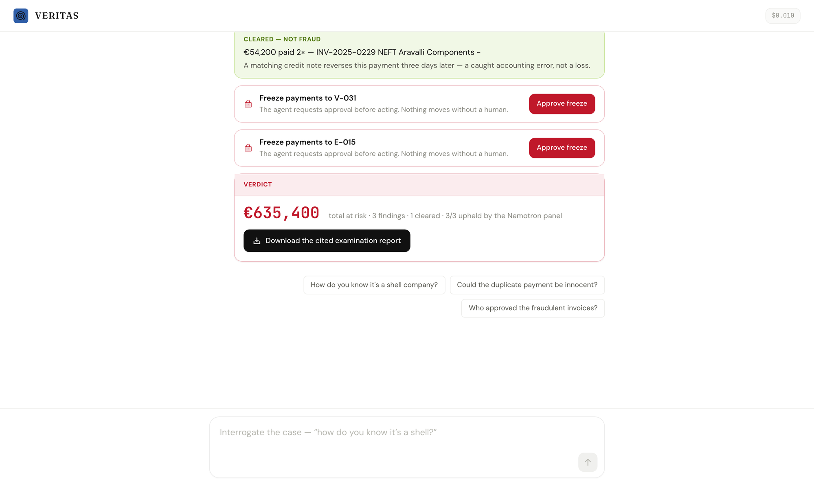
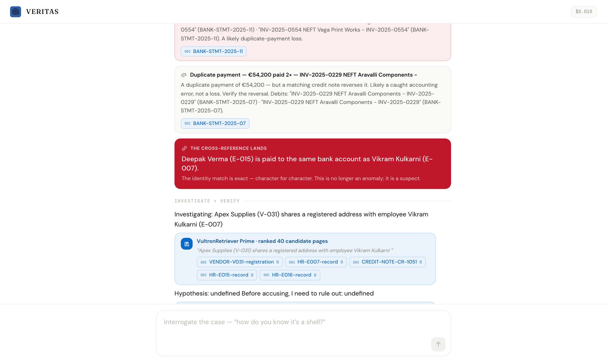
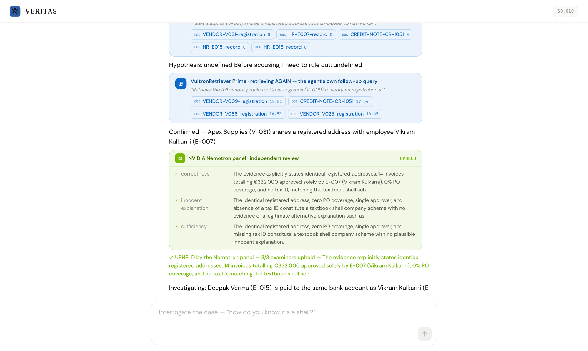
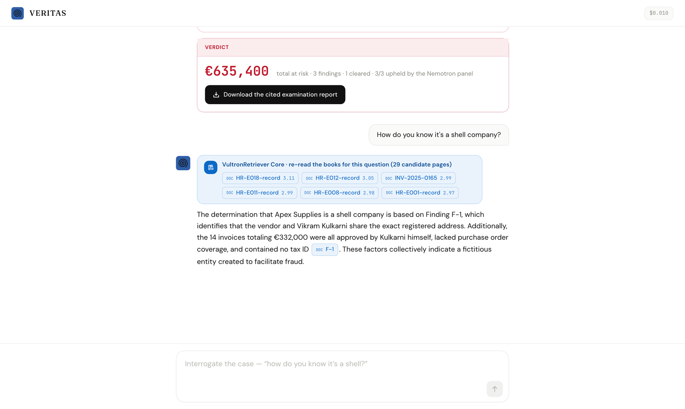

<div align="center">


# VERITAS

### The AI Forensic Auditor

**Companies lose 5% of revenue to fraud. Audits catch 3% of it.**
**VERITAS reads 100% of the books — and files a cited fraud examination in under a minute.**

A chat-native enterprise agent that plans a forensic examination, retrieves evidence with
**VultronRetriever** (twice per anomaly — once for the evidence, once more with its own
follow-up query to kill the innocent explanation), reasons with **Qwen on Vultr Serverless
Inference**, and submits every finding to an independent **NVIDIA Nemotron** panel before filing.

**Live demo:** `http://144.202.6.174:8787` · one click — *"Examine the demo company"* — runs a
genuine examination of 1,090 documents on Vultr, live. If the engine is ever unreachable, the
console automatically replays a recording of a real run, so the demo cannot die.

[The 45-second story](#the-45-second-story) · [Why it's an agent](#why-its-an-agent-not-a-pipeline) ·
[Built on Vultr](#built-entirely-on-vultr) · [Can't cry wolf](#why-it-cant-cry-wolf) · [Run it](#run-it-locally)

<br/>



<sub>The outcome an audit committee walks away with: three confirmed schemes, one exonerated red herring,
two payment freezes awaiting human approval, and a downloadable examination report where every claim
cites its source document.</sub>

</div>

---

## The problem

```
5%       of revenue lost to fraud, every year        ($5 trillion globally · ACFE 2024)
3%       of frauds caught by external audit          (a tip catches 43% — 14x more)
12 mo    median time a fraud runs before detection
```

Audits catch so little because humans **sample** — they read 1% of the books and hope.
The most common fraud on earth (ACFE) is the **billing scheme**: an employee registers a
shell vendor at their own home address, approves its invoices themselves, and drains the
company. The proof is *in* the books — spread across documents no one reads side by side.

## The 45-second story

Upload a folder of a company's books — or click **"Examine the demo company"**. On the demo
books (1,090 documents: 911 invoices, bank statements, payroll registers, HR records, vendor
registrations, board minutes, credit notes — messy, realistic, euro-denominated):

1. **It reads the whole corpus** and works out *whose* books these are (Northwind Trading Co SAS).
2. **It plans the examination** — a real Qwen-generated plan from the actual document mix.
3. **It cross-references every identity** — and the thread turns crimson: *vendor Apex Supplies
   is registered at procurement manager Vikram Kulkarni's home address.*
4. **It investigates each anomaly like an examiner** — hypothesis, innocent explanation,
   then a **second retrieval it writes itself** to test that explanation, then the verdict.
5. **An independent NVIDIA Nemotron panel** attacks every finding from three lenses before it files.
6. **Verdict: €635,400 at risk** — a shell company (€332,000), a ghost employee (€216,000),
   a duplicate payment (€87,400) — and the red-herring duplicate that a credit note reversed
   is **cleared, not filed**. The whole run: **~45 seconds, ~$0.01 of inference.**

Then you interrogate it — *"how do you know it's a shell?"* — and it re-reads the books with
VultronRetriever, live, and answers with citations you can click open.

<div align="center">

<br/><sub>The reveal: an exact, character-for-character identity match between a vendor registration and an employee's HR file.</sub>
</div>

## Why it's an agent, not a pipeline

The track brief warns: *a single retrieve-then-answer call is not enough.* VERITAS's loop,
visible on screen for every anomaly:

```
        PLAN            the examiner reads the corpus stats and states its plan (Qwen, per-upload)
          │
        READ            parser reconstructs the books; a Nemotron drone fleet reads shards in parallel
          │
        CROSS-REFERENCE addresses · bank accounts · tax IDs — exact-string identity matches
          │
   ┌─ INVESTIGATE ────────────────────────────────────────────────────────────┐
   │  retrieve №1   VultronRetriever ranks up to 40 candidate pages           │
   │  hypothesize   states the fraud theory AND the innocent explanation      │
   │  retrieve №2   the agent writes its OWN follow-up query to test it       │  × every anomaly,
   │  decide        confirmed / cleared / unproven — over both rounds         │  in parallel
   │  VERIFY        independent Nemotron panel: 3 adversarial lenses          │
   └───────────────────────────────────────────────────────────────────────────┘
          │
        ACT + REPORT    freeze requests (human approves → receipt) · cited examination report
          │
        INTERROGATE     ask anything; it re-retrieves and answers with citations, streaming
```

The second retrieval is not scripted — the model writes the query (*"Retrieve the lease
agreement or tenant list for 245 Avenue des Champs-Élysées…"*) and the verdict genuinely
depends on what comes back. On clean books, the same loop files **nothing**.

## Built entirely on Vultr

Every model call runs on Vultr Serverless Inference — there is no other provider.

```
DOCUMENT RETRIEVAL   →  VultronRetriever   Prime-8B · Core-4.5B          (/v1/rerank)
   reads whole pages — layout, tables, addresses, tax IDs — and surfaces the page that
   matters even when the query words never appear on it. Core handles routine reranks;
   Prime takes the decisive questions. ~8 retrievals per examination, all load-bearing.
CORE REASONING       →  Qwen3.6-27B  (Qwen3.5-397B fallback)             (/v1/chat/completions)
   writes the plan, the hypotheses, the follow-up queries, and every verdict.
   Chosen by a live bake-off — scripts/bakeoff-results.md.
INDEPENDENT VERIFIER →  NVIDIA Nemotron-Cascade-2                        (/v1/chat/completions)
   a second model family reviews every finding through 3 adversarial lenses, and a
   Nemotron drone fleet reads document shards in parallel during ingest.
BACKEND + CONSOLE    →  one Vultr Cloud Compute VM serves both            (see DEPLOY.md)
```

## Why it can't cry wolf

The false-accusation guards are structural, and they are **fail-safe, not fail-open**:

- **Exact-string evidence for identity findings.** A shell-company finding requires a
  character-for-character address or bank-account match between real documents. No fuzzy vibes.
- **Every anomaly gets a defense counsel.** The examiner must name the innocent explanation
  and retrieve against it before any verdict. Credit note reverses the duplicate? **Cleared.**
- **A hiccup never accuses.** If the reasoning model is unreachable, soft leads file as
  *unproven — escalated*, never as fraud. If a Nemotron reviewer errors, it **abstains** — an
  abstention never upholds an accusation.
- **Proven on clean books.** The eval suite (`pnpm --filter @veritas/evals v2`) runs the full
  live pipeline twice: on the scheme books it confirms all three planted schemes and clears the
  herring; on a clean variant with the proofs removed it files **zero findings**.

```
── SCHEME books (3 planted schemes + 2 herrings) ──          ── CLEAN books ──
✓ shell company confirmed                                    ✓ zero findings filed
✓ ghost employee confirmed
✓ un-reversed duplicate confirmed
✓ reversed-duplicate herring not filed (cleared)
✓ all findings cite evidence
```

## The independent verifier

No finding is filed on one model's say-so. Every confirmed finding faces a panel of three
**NVIDIA Nemotron-Cascade-2** reviewers — a different model family from the examiner, so their
blind spots don't correlate — each attacking from one lens: *correctness*, *the innocent
explanation*, *evidentiary sufficiency*. Majority of answered votes decides; abstentions never
uphold. A refuted soft lead is cleared on the spot.

<div align="center">

</div>

## Interrogate the case

The examination isn't a dead report. Ask a follow-up in the same thread — the engine runs a
**fresh VultronRetriever retrieval for your question** over the actual corpus, then streams a
cited answer token by token. Click any `DOC` chip — including inside the answer — to open the
real source document.

<div align="center">

</div>

## Run it locally

Requires **Node ≥ 22.13** (`node:sqlite`) and pnpm.

```bash
pnpm install
pnpm --filter @veritas/datagen corpus                 # build the 1,090-doc demo books
cp .env.example .env                                  # add your Vultr inference key
pnpm --filter @veritas/server start &                 # forensic engine on :8787
pnpm --filter @veritas/web dev                        # chat console on :3000
# open http://localhost:3000 → "Examine the demo company"
pnpm test                                             # offline correctness suite
pnpm --filter @veritas/evals v2                       # full live eval: scheme + clean books
```

Deploying on Vultr (one VM serves the engine *and* the console): see **[DEPLOY.md](DEPLOY.md)**.

## Stack

`Vultr Serverless Inference` — retrieval on **VultronRetriever** (Prime/Core), reasoning on
**Qwen3.6-27B**, independent verification + extraction fleet on **NVIDIA Nemotron-Cascade-2** ·
`Hono` (SSE) · `Next.js 15` · `Zod` · TypeScript. The corpus generator, parser, detectors,
agent harness, and console were all built during the event.

## Built at the RAISE Summit Hackathon 2026

Every line of VERITAS was written during the event (July 4–5, 2026, Vultr track, Paris).
The commit history is the record: the first commit lands minutes after hacking opened, and the
whole build — agent loop, VultronRetriever integration, Nemotron panel, chat console, evals —
is timestamped inside the window.

## License

MIT — see [LICENSE](LICENSE).
