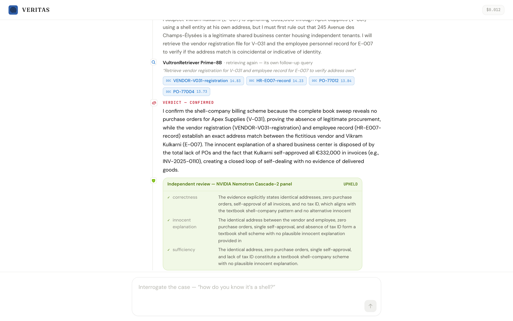
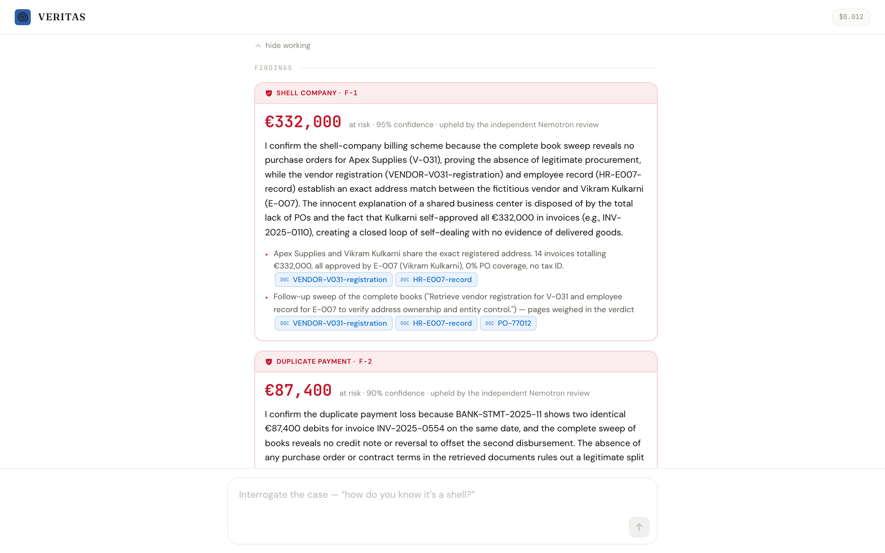

<div align="center">


# VERITAS

### The AI Forensic Auditor

**Occupational fraud costs the world $5 trillion a year (ACFE) — 5% of every company's revenue.**
**External audits catch 3% of it. VERITAS reads 100% of the books — and files a cited fraud
examination in ~90 seconds, for a cent.**

A chat-native enterprise agent that plans a forensic examination, retrieves evidence with
**VultronRetriever** (twice per lead — the second time with a query the model writes itself),
weighs both rounds with **Qwen on Vultr Serverless Inference**, and files an accusation **only
when a second model family — an independent NVIDIA Nemotron panel — agrees.**

**▶ Demo video:** **https://www.youtube.com/watch?v=xnTSWUwE0qA** (75 seconds)

**Live demo:** **https://veritas.144-202-6-174.sslip.io** — click **"Audit the sample company"**
and watch a genuine examination of 1,090 documents run on Vultr, live. Or attach your own
folder of books — it reads those instead.

[The one-minute story](#the-one-minute-story) · [Why it's an agent](#why-its-an-agent-not-a-pipeline) ·
[Two families must agree](#no-accusation-on-one-model-familys-say-so) · [Built on Vultr](#built-entirely-on-vultr) ·
[Can't cry wolf](#why-it-cant-cry-wolf) · [Run it](#run-it-locally)

<br/>


<sub>The outcome an audit committee walks away with: three confirmed schemes, one exonerated red herring,
a prioritized action list, and a downloadable examination report where every claim cites its source
document — 1,090 documents examined in 67 seconds for $0.012 of inference.</sub>

</div>

---

## For the judges — fastest path & track checklist

**60-second route:** [watch the video](https://www.youtube.com/watch?v=xnTSWUwE0qA) → open the
[live demo](https://veritas.144-202-6-174.sslip.io) and click **"Audit the sample company"** —
a real 1,090-document examination runs in front of you (~60–100s) → read
[the filing rule](#no-accusation-on-one-model-familys-say-so).

| Track requirement | Where VERITAS meets it |
|---|---|
| **Agent, not retrieve-then-answer** | Plans per-corpus → retrieves **twice per lead** (the second with a query the model writes itself) → streams a verdict over both rounds → a second model family must agree before filing. All visible on screen. |
| **VultronRetriever for document retrieval** | Load-bearing everywhere evidence moves: Core-4.5B ranks the first pass, Prime-8B takes the decisive follow-up, and every interrogation question triggers a fresh rerank (`server/src/retriever.ts`) |
| **All core reasoning on Vultr Serverless Inference** | Qwen3.6 examiner + NVIDIA Nemotron fleet & review panel — `server/src/llm.ts` is one page and names no other provider. (VultronRetriever models are rerankers by design — they decide what evidence every verdict sees; the Vultr-served LLMs do the deciding.) |
| **Backend deployed on Vultr** | One Vultr Cloud Compute VM serves the engine and the console ([DEPLOY.md](DEPLOY.md)) |
| **Public demo URL + video + docs** | Links above; setup steps below; architecture + workflow throughout this file |
| **Messy real-world documents** | 1,090 mixed documents (invoices, bank statements, payroll, HR, board minutes, credit notes) — plus a second company in another currency |
| **Built during the event** | Every commit is timestamped inside the hacking window — the history is the record |

## The problem

```
5%       of revenue lost to fraud, every year        ($5 trillion globally · ACFE 2024)
3%       of frauds caught by external audit          (a tip catches 43% — 14x more)
12 mo    median time a fraud runs before detection
```

Audits catch so little because humans **sample** — they read 1% of the books and hope.
The most common fraud on earth (ACFE) is the **billing scheme**: an employee registers a
shell vendor at their own home address, approves its invoices themselves, and drains the
company. The proof is *in* the books — spread across documents no one reads side by side.

## The one-minute story

Click **"Audit the sample company"** — or attach your own folder of books and ask
*"audit my company, please."* On the sample books (1,090 documents: 911 invoices, bank
statements, payroll registers, HR records, vendor registrations, board minutes, credit
notes — messy, realistic, euro-denominated):

1. **It reads the whole corpus** and works out *whose* books these are (Northwind Trading Co SAS).
2. **It plans the examination** — a real Qwen-generated plan from the actual document mix.
3. **It cross-references every identity** — and the thread turns crimson: *vendor Apex Supplies
   is registered at procurement manager Vikram Kulkarni's home address.*
4. **It investigates each lead like an examiner** — streamed hypothesis, the innocent
   explanation it must rule out, a **second retrieval it writes itself** to test that
   explanation, then a **streamed verdict weighing both rounds**.
5. **An independent NVIDIA Nemotron panel** attacks every accusation from three lenses —
   and if the panel refuses to uphold, **the finding is not filed.**
6. **Verdict: €635,400 at risk** — a shell company (€332,000), a ghost employee (€216,000),
   a duplicate payment (€87,400) — and the red-herring duplicate that a credit note reversed
   is **cleared, not filed**. The whole run: **~60–100 seconds, ~$0.01 of inference.**

Then you interrogate it — *"how do you know it's a shell?"* — and it re-reads the books with
VultronRetriever, live, and answers with citations you can click open.

## Why it's an agent, not a pipeline

The track brief warns: *a single retrieve-then-answer call is not enough.* VERITAS's loop,
visible on screen for every lead:

```
        PLAN            the examiner reads the corpus stats and states its plan (Qwen, per-upload)
          │
        READ            a deterministic parser reconstructs 100% of the books (that's why numbers
          │             can't hallucinate); a Nemotron drone fleet independently samples shards
          │             across the corpus in parallel as an AI cross-check
          │
        CROSS-REFERENCE addresses · bank accounts · tax IDs — exact-string identity matches
          │
   ┌─ INVESTIGATE ─────────────────────────────────────────────────────────────┐
   │  retrieve №1   VultronRetriever Core ranks up to 40 candidate pages       │
   │  hypothesize   streams its fraud theory AND the innocent explanation      │
   │  retrieve №2   the agent writes its OWN follow-up query — the decisive    │  × every lead,
   │                question goes to VultronRetriever Prime                    │  in parallel
   │  weigh         streams the verdict reasoning over BOTH retrieval rounds   │
   │                → confirmed / cleared / unproven, with confidence          │
   │  VERIFY        independent Nemotron panel: 3 adversarial lenses.          │
   │                Refuted → NOT filed. Binding.                              │
   └────────────────────────────────────────────────────────────────────────────┘
          │
        REPORT          a cited examination report (PDF) + recommended actions
          │
        INTERROGATE     ask anything; it re-retrieves and answers with citations, streaming
```

The second retrieval is not scripted — the model writes the query (*"Retrieve the vendor
registration file for V-031 and the employee record for E-007…"*), the results are fed into
the verdict pass, and the verdict prose you watch stream **is** the statement that gets filed.
On clean books, the same loop files **nothing**.

<div align="center">

<br/><sub>One lead, end to end: the agent's own follow-up query goes to VultronRetriever Prime, the verdict
streams over both evidence rounds, and the NVIDIA Nemotron panel reviews the accusation through three
adversarial lenses before it may be filed.</sub>
</div>

## No accusation on one model family's say-so

**The filing rule:** a finding is filed only when the **Qwen examiner confirms it on the
retrieved documents** *and* the **NVIDIA Nemotron panel independently upholds it.** Two
different model families, so their blind spots don't correlate — the reviewer has **no
fallback to the examiner's model, by design.** Each of the three Nemotron reviewers attacks
one lens — *correctness*, *the innocent explanation*, *evidentiary sufficiency* — and a
majority of answered votes decides. A reviewer that errors **abstains**, and an abstention
never upholds. If the panel refuses, the accusation is **not filed** — it is escalated as
*unproven*, with the panel's objection on the record.

Disagreement is handled the same way — across families. If the examiner's verdict
contradicts dispositive document evidence (an exact identity match; the same invoice
debited twice with no reversal anywhere in the books), the lead goes to the panel for
**arbitration**, with the examiner's dissent recorded on the finding. And a panel refusal
on dispositive evidence must survive a **second, fresh panel** before it stands — a single
flaky reviewer response can neither file nor erase a documented finding.

The reported confidence is honest arithmetic: the **minimum** of the examiner's stated
confidence and the weakest upholding Nemotron vote.

<div align="center">

<br/><sub>What gets filed: the verdict prose the model streamed, the ledger-recomputed amount, the citations
(every chip opens the real document), and the second-round retrieval pages that were weighed in the verdict.</sub>
</div>

## Built entirely on Vultr

Every model call runs on Vultr Serverless Inference — there is no other provider.

```
DOCUMENT RETRIEVAL   →  VultronRetriever   Prime-8B · Core-4.5B          (/v1/rerank)
   reads whole pages — layout, tables, addresses, tax IDs — and surfaces the page that
   matters even when the query words never appear on it. Core handles the wide first pass;
   Prime takes the decisive follow-up question. ~10 retrievals per examination, plus one
   per interrogation question — all load-bearing.
CORE REASONING       →  Qwen3.6-27B  (Qwen3.5-397B fallback)             (/v1/chat/completions)
   writes the plan, streams the hypotheses and follow-up queries, and streams every
   verdict. Chosen by a live bake-off — scripts/bakeoff-results.md.
INDEPENDENT VERIFIER →  NVIDIA Nemotron-Cascade-2                        (/v1/chat/completions)
   a second model family reviews every accusation through 3 adversarial lenses — with NO
   fallback to the examiner's model — and a Nemotron drone fleet samples document shards
   across the corpus in parallel as an independent read.
BACKEND + CONSOLE    →  one Vultr Cloud Compute VM serves both            (see DEPLOY.md)
```

The console ships **stack-neutral** — a real enterprise agent doesn't brand its steps. The
`stack` toggle in the header (or `?stack=1`) reveals the live model names; the screenshots
in this README have it on.

## Why it can't cry wolf

The false-accusation guards are structural, and they are **fail-safe, not fail-open**:

- **Exact-string evidence for identity leads.** A shell-company lead requires a
  character-for-character address or bank-account match between real documents before the
  examiner ever sees it. No fuzzy vibes.
- **Every lead gets a defense counsel.** The examiner must name the innocent explanation
  and retrieve against it before any verdict — and clearing is a first-class outcome: the
  reversed duplicate is *cleared, with the credit note cited*, not quietly dropped.
- **Dollar figures are never generated.** Every amount is recomputed deterministically from
  the ledger and bank statements. Models decide *judgment*; code does *arithmetic*.
- **A hiccup never accuses.** Streams that die are retried once; if the examiner is still
  unreachable, the lead resolves as *unproven — escalated*, never as fraud. If a Nemotron
  reviewer errors, it **abstains** — an abstention never upholds an accusation.
- **Proven on clean books.** The eval suite (`pnpm --filter @veritas/evals v2`) runs the full
  live pipeline twice: on the scheme books it confirms all three planted schemes and clears the
  herring; on a clean variant with the proofs removed it files **zero findings**.

```
── SCHEME books (3 planted schemes + 2 herrings) ──          ── CLEAN books ──
✓ shell company confirmed                                    ✓ zero findings filed
✓ ghost employee confirmed                                       (29s · $0.018)
✓ un-reversed duplicate confirmed
✓ no over-filing (≤3 findings)
✓ reversed-duplicate herring not filed — cleared
✓ all findings cite evidence
  €635,400 at risk · 61s · $0.01
```

There is a **second bundled company** — Kestrel Manufacturing Inc, dollar-denominated, with
different names, amounts, and documents — so you can watch the same agent work books it has
never seen, in another currency. Or generate your own; or upload anything.

## Interrogate the case

The examination isn't a dead report. Ask a follow-up in the same thread — the engine runs a
**fresh VultronRetriever retrieval for your question** over the actual corpus, then streams a
cited answer token by token. Click any `DOC` chip — including inside the answer — to open the
real source document.

<div align="center">

</div>

## Architecture

```
veritas/
├─ server/          the forensic engine (Hono + SSE, Node 22)
│  ├─ orchestrator2.ts   the agent loop: plan → fleet → detect → investigate → verify
│  ├─ retriever.ts       VultronRetriever rerank (Prime/Core, fail-open)
│  ├─ panel.ts           the binding NVIDIA Nemotron 3-lens review panel
│  ├─ extract.ts         deterministic parser + Nemotron drone fleet
│  ├─ detect.ts          pure cross-reference detectors (shell/ghost/duplicate)
│  ├─ fraud-kb.ts        the ACFE fraud-tree knowledge base + examiner's method
│  └─ qa2.ts             live interrogation: recall → rerank → streamed cited answer
├─ web/             the chat console (Next.js 15, static export, served by the engine)
├─ datagen/         two synthetic companies (EUR + USD), seeded & byte-reproducible
├─ evals/           the live eval: scheme books + clean books, full pipeline
└─ scripts/         the model bake-off that picked the stack
```

One Vultr VM serves the engine and the console on a single origin. Runs are journaled
server-side and streamed over SSE with replay-from-index — refresh the page mid-examination
and it picks up exactly where it was.

## Run it locally

Requires **Node ≥ 22.13** and pnpm.

```bash
pnpm install
pnpm --filter @veritas/datagen corpus                 # build the 1,090-doc demo books
cp .env.example .env                                  # add your Vultr inference key
pnpm --filter @veritas/server start &                 # forensic engine on :8787
pnpm --filter @veritas/web dev                        # chat console on :3000
# open http://localhost:3000 → attach datagen/data/out/corpus and ask "audit my company, please"
pnpm test                                             # offline determinism suite
pnpm --filter @veritas/evals v2                       # full live eval: scheme + clean books
```

Deploying on Vultr (one VM serves the engine *and* the console): see **[DEPLOY.md](DEPLOY.md)**.

## Stack

`Vultr Serverless Inference` — retrieval on **VultronRetriever** (Prime/Core), reasoning on
**Qwen3.6-27B**, independent verification + extraction fleet on **NVIDIA Nemotron-Cascade-2** ·
`Hono` (SSE) · `Next.js 15` · TypeScript. The corpus generators, parser, detectors, agent
loop, review panel, evals, and console were all built during the event.

## Built at the RAISE Summit Hackathon 2026

Every line of VERITAS was written during the event (July 4–5, 2026, Vultr track).
The commit history is the record: the first commit lands minutes after hacking opened, and the
whole build — agent loop, VultronRetriever integration, Nemotron panel, chat console, evals —
is timestamped inside the window.

## License

MIT — see [LICENSE](LICENSE).
